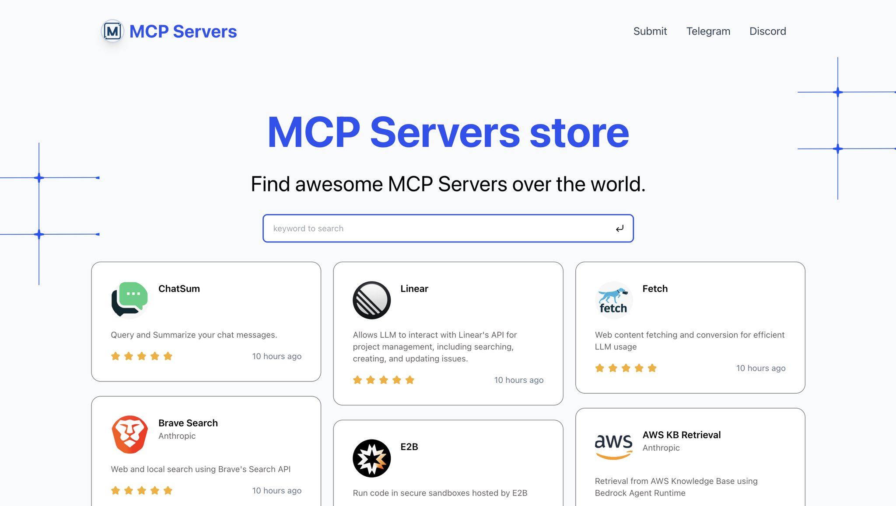

## MCP Directory

a directory for Awesome MCP Servers.

live preview: [https://mcp.so](https://mcp.so)



## Quick Start

1. clone the repo

```bash
git clone https://github.com/chatmcp/mcp-directory.git
cd mcp-directory
```

2. install dependencies

```bash
pnpm install
```

3. prepare database

create a database with [Supabase](https://supabase.com/)

run the sql file in `data/install.sql`

4. set env variables

put a .env file in the root directory

with env variables:

```env
SUPABASE_URL=""
SUPABASE_ANON_KEY=""

NEXT_PUBLIC_WEB_URL="http://localhost:3000"
```

5. run the dev server

```bash
pnpm dev
```

6. preview the site

open [http://localhost:3000](http://localhost:3000) in your browser

## Community

- [MCP Server Telegram](https://t.me/+N0gv4O9SXio2YWU1)
- [MCP Server Discord](https://discord.gg/RsYPRrnyqg)

## About the author

- [idoubi](https://bento.me/idoubi)
- [Follow me on Twitter](https://x.com/idoubi)
- [Buy me a coffee](https://www.buymeacoffee.com/idoubi)